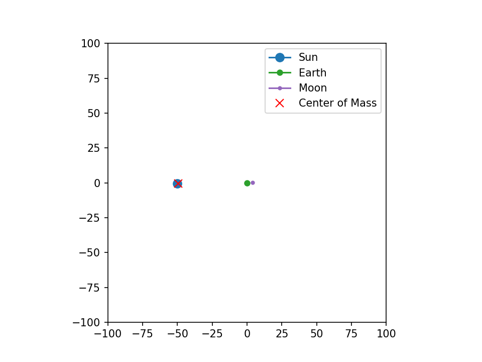
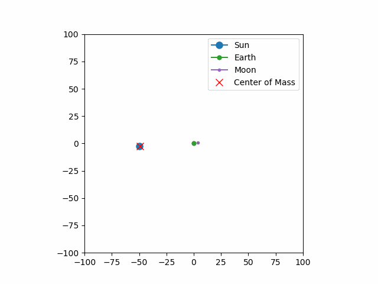

# gravSim - Gravitational Simulation

A simple gravitational simulation demonstrating orbital mechanics between celestial bodies using Python, NumPy, and Matplotlib.

## Overview

gravSim is an educational physics simulation that models the gravitational interaction between celestial bodies (Sun, Earth, and Moon) in a 2D plane. The simulation shows how bodies attract each other according to Newton's law of universal gravitation and displays their orbital paths over time.

## Features

- Real-time gravitational simulation using Newton's law of universal gravitation
- Visual representation of celestial bodies with trails showing their orbital paths
- Center of mass tracking
- Interactive visualization with matplotlib
- Clean exit handling (Ctrl+C)

## Screenshots and GIFs


*Figure 1: Screenshot of the gravSim simulation showing Sun, Earth, Moon and their trails.*


*Figure 2: Animated GIF showing orbital motion of the Earth-Moon system around the Sun.*

## Requirements

- Python 3.x
- NumPy
- Matplotlib

Install dependencies using:
```bash
pip install numpy matplotlib
```

## Usage

Run the simulation:
```bash
python3 gravSim_v1.0.py
```

The simulation will open a window showing:
- Orange circle: Sun (massive central body)
- Blue circle: Earth (orbiting the Sun)
- Gray circle: Moon (orbiting the Earth)
- Red X: Center of mass of the system
- Colored trails: Orbital paths of each body

Press Ctrl+C in the terminal to cleanly exit the simulation.

## Implementation Details

The simulation consists of:
- **Body Class**: Represents celestial bodies with properties for mass, position, velocity, and acceleration
- **Physics Engine**: Calculates gravitational forces between all pairs of bodies
- **Rendering**: Uses matplotlib for real-time visualization with animated trails
- **Reference Frame**: Optionally renders positions relative to a focus body (Earth by default)

## Files

- `gravSim_v1.0.py`: Main simulation script
- `gravSim_v1.1.py`: Empty placeholder for future versions
- `LICENSE`: CC0 1.0 Universal (Public Domain) license
- `README.md`: This file
- `screenshots/` (directory): Contains screenshots of the simulation
- `gifs/` (directory): Contains animated GIFs of the simulation

## License

This project is released under the [CC0 1.0 Universal](LICENSE) (Public Domain) license, meaning you are free to use, modify, and distribute this code for any purpose without restriction.

## Educational Value

This simulation demonstrates:
- Orbital mechanics and Kepler's laws
- Center of mass motion in multi-body systems
- Numerical integration of differential equations
- Visualization of physics concepts

## Future Improvements

Potential enhancements for future versions:
- Add more celestial bodies (planets, satellites)
- Implement different integration algorithms (Verlet, Runge-Kutta)
- Add user controls for simulation speed and parameters
- Include energy and momentum tracking
- 3D visualization option
- Collision detection and handling

## Acknowledgments

Based on fundamental physics principles of gravitational attraction and numerical simulation techniques.